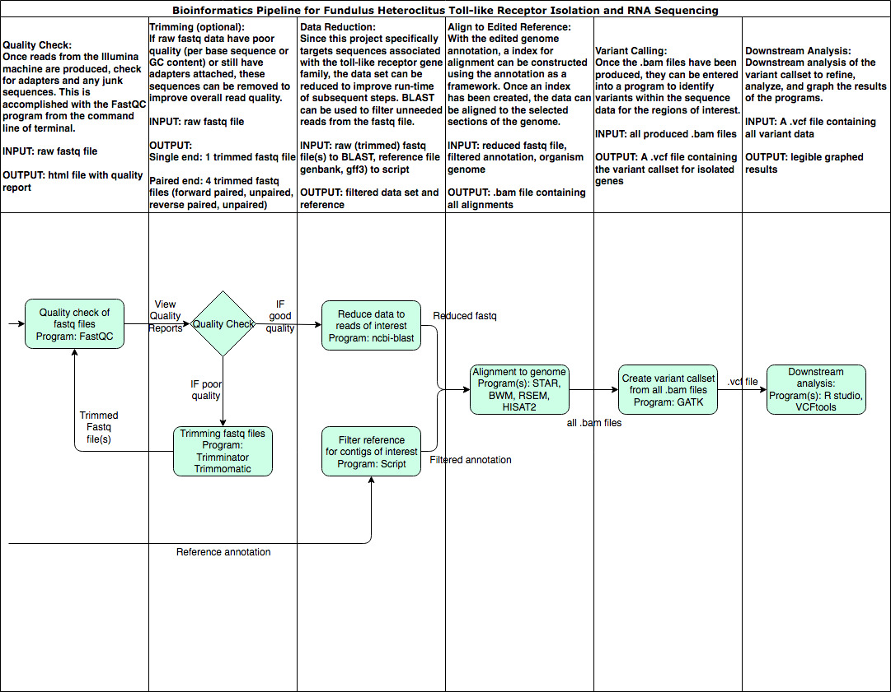

# fundulus
The primary goal of this project is to find variation of LRR sequence on the gene of toll-like receptors of fundulus to determine if natural selection has occurred for those LRR region. 

